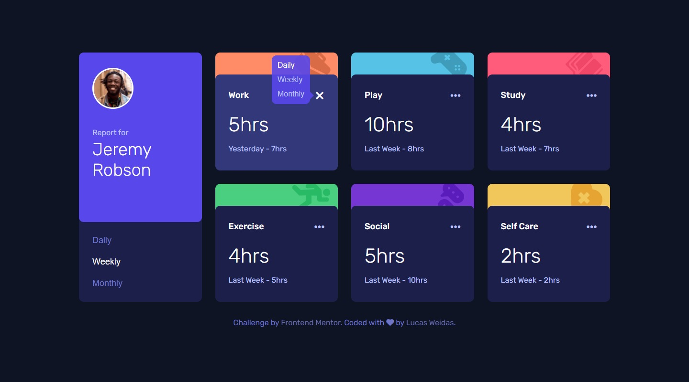

# Frontend Mentor - Time tracking dashboard solution

## Welcome! 👋

Thanks for checking out this front-end coding challenge solution.

## Table of contents
- [Overview](#overview)
  - [Links](#links)
- [My process](#my-process)
  - [Built with](#built-with)
  - [What I learned](#what-i-learned)
- [Author](#author)

## Overview

This is a solution to the [Time tracking dashboard challenge on Frontend Mentor](https://www.frontendmentor.io/challenges/time-tracking-dashboard-UIQ7167Jw). Frontend Mentor challenges help you improve your coding skills by building realistic projects.

### Links

- Solution URL: [github.com/lucasweidas/](https://github.com/lucasweidas/)
- Live Site URL: [lucasweidas.github.io//](https://lucasweidas.github.io//)

## My process

### Built with

- Semantic HTML5 markup
- CSS custom properties
- CSS Grid
- CSS Flex
- Mobile-first workflow
- Pure JS

### What I learned

To complete this project i took some time to study about `JSON`. So this is my first project using it, and i think it's a good result.

I also learned a little about `XMLHttpRequest`, to resquest the data from the JSON file.

## Author

- Github - [@lucasweidas](https://github.com/LucasWeidas)
- Frontend Mentor - [@lucasweidas](https://www.frontendmentor.io/profile/lucasweidas)
- CodePen - [@lucasweidas](https://codepen.io/lucasweidas)
